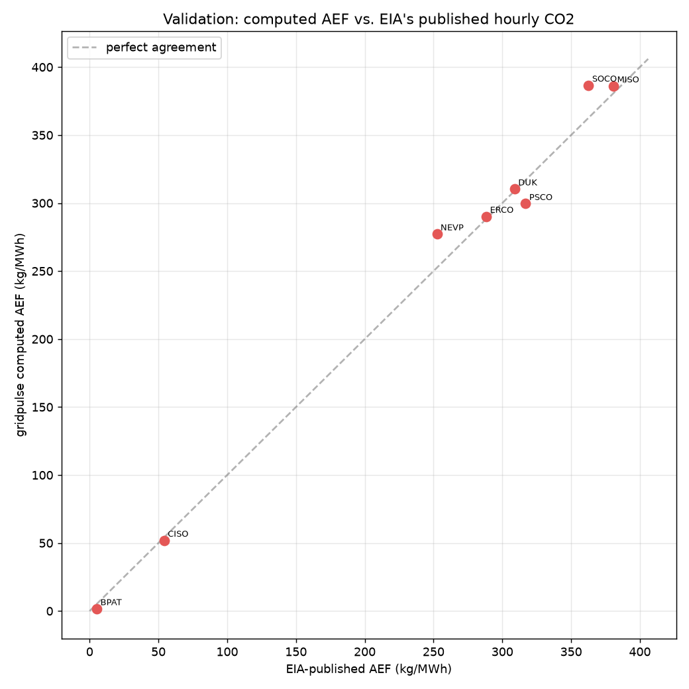
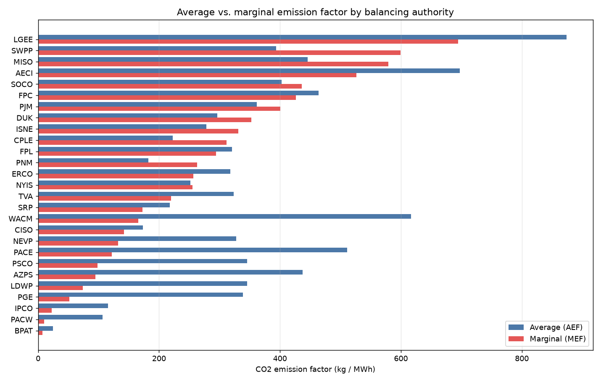
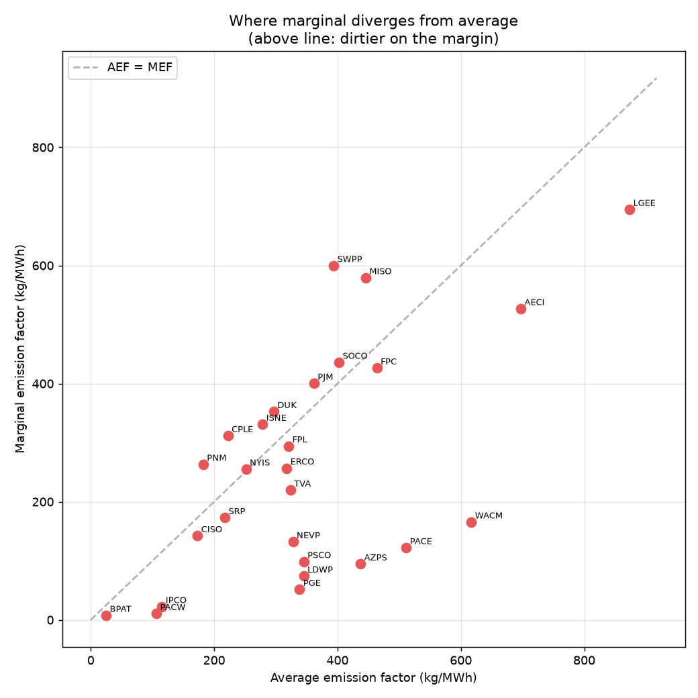
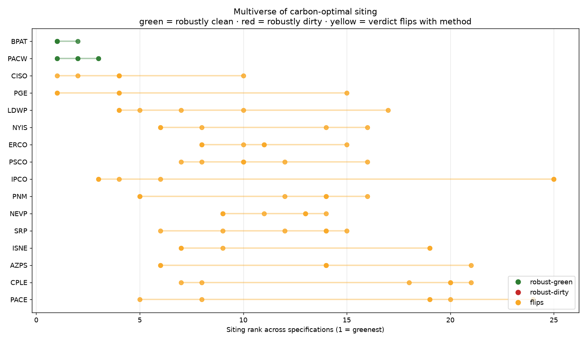

# gridpulse

[](https://doi.org/10.5281/zenodo.21227652)

**Where should the next data center be sited to minimize _marginal_ grid carbon?**

A new data center is an *increment* of load, so its climate impact is set by the
grid's **marginal** emission factor (MEF), not its **average** (AEF). Average and
marginal factors can *invert* the ranking of "greenest" balancing authorities — a
hydro-rich BA looks clean on average, but its extra MWh is gas. gridpulse computes
both from live EIA data, validates the average against EIA's own published hourly
CO2, and goes further: it traces interchange flows to get **consumption-based**
(import-adjusted) marginal carbon — the truly siting-correct number — and quantifies
the gap between where data centers are actually being built and where a
carbon-optimal build-out would put them.

## What it does

- **Ingests** hourly fuel mix, demand, and BA-to-BA interchange for 27 US balancing
  authorities plus monthly retail sales, from the [EIA API v2](https://www.eia.gov/opendata/documentation/),
  with retry/pagination/caching and a **per-BA incremental watermark**.
- **Warehouses** to DuckDB + Parquet (CSV fallback), idempotent upserts.
- **Computes** average (AEF) and marginal (Siler-Evans MEF, bootstrap CIs) emission
  factors per BA.
- **Validates** the computed AEF against EIA's *published* hourly CO2 (Grid Monitor
  per-BA workbooks) — real ground truth, not self-consistency.
- **Traces flows** for consumption-based emissions (de Chalendar et al. 2019) and a
  consumption-based marginal factor.
- **Ranks siting** and computes the actual-vs-optimal carbon gap against real
  data-center locations.
- **Forecasts** demand (quantile GBM + conformal bands) with optional weather
  (degree-hour) features.
- **Dashboard** (Streamlit): US map, siting explorer, average-vs-marginal scatter.

## Reproduce from zero

```bash
git clone <this repo> && cd gridpulse
python -m venv .venv && source .venv/bin/activate
pip install -e ".[prod,dev]"

cp .env.example .env          # then add a free key from
                              # https://www.eia.gov/opendata/register.php
echo "EIA_API_KEY=<your key>" > .env

pytest -q                     # 41 tests, all green

python -m gridpulse.cli run-offline          # synthetic demo, no key needed
python -m gridpulse.cli backfill --months 24 # live incremental pull -> warehouse
python -m gridpulse.cli run-now              # compute AEF/MEF/siting from live data
python -m gridpulse.cli validate --months 3  # cross-check AEF vs EIA published CO2
python -m gridpulse.cli status               # warehouse manifest / watermarks

streamlit run src/gridpulse/dashboard.py     # interactive dashboard
```

Without an `EIA_API_KEY`, `run-now` falls back to the synthetic fixture (figures are
watermarked SYNTHETIC). With a key, the DuckDB+Parquet warehouse activates
automatically and figures are generated from real data.

## Layout

```
src/gridpulse/
  config.py      env/config, optional-dep detection, backend selection
  regions.py     27 EIA BAs, fuel→CO2 factors, load-center coords
  ingest.py      EIA v2 client (retry, pagination, cache)
  storage.py     DuckDB+Parquet warehouse, per-BA watermark manifest
  emissions.py   AEF + Siler-Evans MEF (+ bootstrap CI)
  analysis.py    siting index, rank inversions, siting gap
  flowtrace.py   consumption-based emissions (de Chalendar 2019)
  siting.py      facility→BA mapping, combined ranking, actual-vs-optimal gap
  model.py       leakage-safe features, quantile forecaster, backtest, conformal
  weather.py     Open-Meteo degree-hour features
  reporting.py   charts + markdown report
  dashboard.py   Streamlit app
  pipeline.py    offline + live orchestration
  validate.py    AEF vs EIA published CO2 cross-check
  cli.py         command-line interface
```

## Key results

Generated from **real EIA data** (24 months hourly, 27 balancing authorities).
Full numbers in [`EVIDENCE.md`](EVIDENCE.md) (validation against EIA) and
[`FINDINGS.md`](FINDINGS.md) (consumption-based re-ranking and the actual-vs-optimal
siting gap).

**Validation** — computed AEF vs EIA's published hourly CO2, using EIA's own
per-fuel factors, matches to ~1–5% for fossil-dominated BAs (ERCO −2.4%, MISO
−0.6%, DUK −5.4%, SOCO −1.5%, PSCO −1.6%, NEVP −1.2%):



**Average vs. marginal** — the two factors re-rank the "greenest" BAs. Points above
the diagonal are dirtier on the margin than the average suggests:




**The multiverse (headline research finding).** The carbon-optimal siting
recommendation is contingent on the analyst's accounting choices. Ranking BAs under
six defensible specifications (average; short-run marginal by regression, by VRE
instrument, and consumption/import-adjusted; long-run Cambium LRMER; Cambium
short-run), **24 of 27 balancing authorities flip their siting rank** — IPCO spans
rank 3→25 — and only two Pacific-NW hydro BAs (BPAT, PACW) are robustly green.
See [`PAPER.md`](PAPER.md) and [`FINDINGS.md`](FINDINGS.md).



## Data sources & methods

- EIA API v2 — hourly fuel mix / demand / interchange / retail sales.
- EIA Hourly Electric Grid Monitor per-BA workbooks — published hourly CO2 (validation ground truth).
- Siler-Evans, Azevedo & Morgan (2012), *Environ. Sci. Technol.* — marginal emission factors.
- de Chalendar, Taggart & Azevedo (2019), *PNAS* — consumption-based emissions via flow-tracing.
- Open-Meteo ERA5 archive — hourly temperature for degree-hour features.

## License

MIT.
